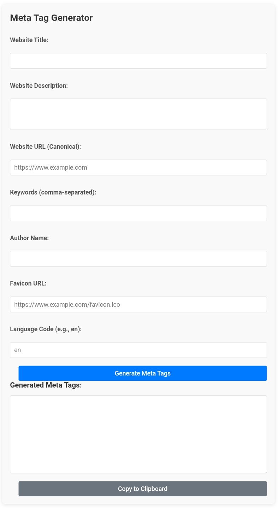

# 🧠 Meta Tag Generator

A clean, fast, and responsive web-based tool to generate SEO-friendly meta tags (HTML `<meta>` tags) for any website or blog. This tool helps developers and content creators easily generate tags for search engines, social media sharing (Open Graph, Twitter Cards), and browser compatibility.



---

## ✨ Features

- 🔤 Supports Title, Description, Keywords, Author, Canonical URL, Favicon, and Language Code
- 🧠 Generates SEO, Open Graph, and Twitter Card tags
- 📋 One-click copy to clipboard
- 💡 Client-side only — no dependencies or backend required
- 📱 Fully responsive design

---

## 🚀 Live Demo

🔗 [Use the tool here](https://seolyticshub.blogspot.com/2025/06/meta-tag-generator-tool-blogger-seo.html)  


---

## 🛠️ Technologies Used

- HTML5
- CSS3 (responsive, modern design)
- JavaScript (Vanilla)

---

## 🧩 How to Use

1. Fill out the input fields: Title, Description, Keywords, etc.
2. Click **"Generate Meta Tags"**
3. Copy the output using the **"Copy to Clipboard"** button
4. Paste the generated code into the `<head>` section of your HTML page

---


## 📁 Folder Structure

```
📦 meta-tag-generator/
├── index.html
└── README.md
```

---

## 📄 License

This project is licensed under the **MIT License** – feel free to use, modify, and distribute it.

---

## 🙌 Author

Made with 💙 by [Sawan](https://github.com/codersawan49)  
Want to improve it? PRs are welcome!
